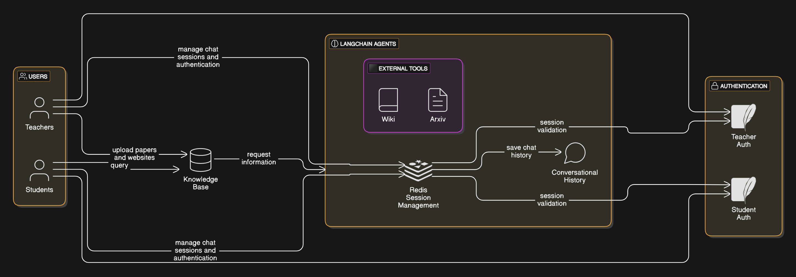

# Research Assistant Chatbot

This project is a Research Assistant Chatbot designed to provide an intuitive learning and teaching experience for both students and teachers. The chatbot leverages **LangChain agents** to perform advanced query handling and utilizes conversational history for maintaining context. The platform supports the following features:

- **Student and Teacher Authentication**: Secure login system using SQLite Cloud for role-based access.
- **Knowledge Base Integration**: A robust knowledge base for answering queries. When data is unavailable, the chatbot uses external tools like Wikipedia and ArXiv to gather the required information.
- **Teacher Functionality**: Teachers can upload research papers and provide website details to enrich the knowledge base.
- **Student Functionality**: Students can ask queries and learn interactively through the chatbot.

## Key Features

1. **LangChain Agents**:

   - Enable seamless integration with multiple external tools for retrieving information.
   - Automate the process of querying Wikipedia, ArXiv, and other sources when the internal knowledge base lacks information.
2. **Conversational History**:

   - Maintains conversation context for meaningful and dynamic interactions.
   - Helps in providing continuity in multi-turn conversations.
   - Stores conversation threads for each user using Redis.
3. **Authentication System**:

   - Uses SQLite Cloud to differentiate between student and teacher roles.
   - Ensures data privacy and role-specific functionality.
4. **Teacher-Specific Features**:

   - Upload research papers and provide curated website links to enhance the chatbot's knowledge base.
   - Ensure students have reliable and accurate resources.
5. **Student-Specific Features**:

   - Query the knowledge base to learn about various topics.
   - Engage with the chatbot to gain additional context and explanations on research material.

## How It Works

1. **Setup Knowledge Base**:

   - Teachers upload content via the portal.
   - The knowledge base is enriched with curated and reliable information.
2. **Query Handling**:

   - Students submit their questions through the chatbot.
   - If the knowledge base contains the answer, it responds directly.
   - If not, the LangChain agents query external resources (e.g., Wikipedia, ArXiv) to retrieve the required information.
3. **Conversation Continuity**:

   - Conversational history ensures the bot remembers the context, enabling multi-turn interactions.
   - Redis is used to store and retrieve conversation threads for each user.

## Technologies Used

- **Python**: Core programming language.
- **LangChain**: For creating agents and integrating external tools.
- **SQLite Cloud**: For managing authentication and role-based access.
- **Redis**: For storing conversation threads and managing session data.
- **Wikipedia API**: For querying Wikipedia.
- **ArXiv API**: For retrieving academic research papers.

## Installation

1. Clone the repository:
   ```bash
   git clone https://github.com/sumairrasi/Research-Bot.git
   ```
2. Navigate to the project directory:
   ```bash
   cd Research-Bot
   ```
3. Install dependencies:
   ```bash
   pip install -r requirements.txt
   ```
4. Configure environment variables:
   ```bash
   GROQ_API_KEY=<your-groq-api-key>
   LANGCHAIN_API_KEY=<your-langchain-api-key>
   HF_TOKEN=<your-huggingface-token>
   LANGCHAIN_ENDPOINT=<your-langchain-endpoint>
   LANGCHAIN_PROJECT=<your-langchain-project-name>
   PINECONE_API_KEY=<your-pinecone-api-key>
   PINECONE_INDEX_NAME=<your-pinecone-index-name>
   REDIS_HOST=<your-redis-host>
   REDIS_PASSWORD=<your-redis-password>
   REDIS_PORT=<your-redis-port>
   DB_URL=<your-database-url>
   ```
5. Run the application:
   ```bash
   streamlit run main.py
   ```

## Usage

1. **Teachers**:

   - Log in with your teacher credentials.
   - Upload research papers and website links to the knowledge base.
2. **Students**:

   - Log in with your student credentials.
   - Ask questions and receive answers from the chatbot.


## Architecture Diagram

Below is the architecture diagram for the Research Assistant Chatbot:


The architecture highlights the following components:
1. **Frontend**: Streamlit application for user interaction.
2. **Authentication**: Role-based access control using SQLite Cloud.
3. **Knowledge Base**: Data enrichment from uploaded papers and websites.
4. **LangChain Agents**: For retrieving information from Wikipedia and ArXiv when required.
5. **Redis**: For storing conversation history and managing user sessions.
6. **Backend**: Python application managing the chatbot logic and external integrations.

## Future Enhancements

- Add support for additional APIs for broader information retrieval.
- Integrate with more sophisticated NLP models for better query understanding.
- Enhance UI/UX for a more user-friendly experience.

## License

This project is licensed under the MIT License. See the LICENSE file for details.

## Contributing

Contributions are welcome! Please submit a pull request or open an issue for discussion.

---

For any questions or support, please feel free to contact me at [sumairrazi585@gmail.com](mailto:sumairrazi585@gmail.com).

Happy Learning!
